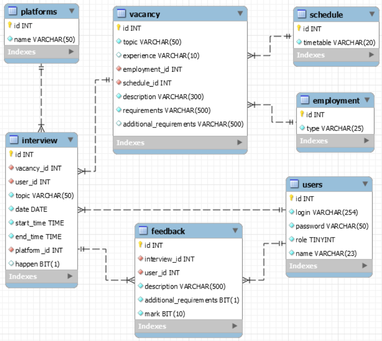

<b>Администратор</b> управляет пользователями. Имеет возможность изменить роль юзера. Может добавлять новые, редактировать
и удалять уже существующие платформы для видеоконференций.

<b>Директор</b> также может управлять платформами для видеоконференций. Так же подает объявления с вакансиями, для набора 
в компанию необходимых сотрудников. Имеет все инструменты для управления всеми имеющимися вакансиями. Может просматривать
результаты собеседований, которые подготовили интервьюеры после собеседования.

<b>Интервьюер</b> при просмотре объявлений с вакансиями, может запланировать собеседование по той или иной вакансии.
После того как собеседование было запланировано, интервьюер в своем профиле может его отменить или изменить. Если 
собеседование состоялось, интервьюер может оставить отзыв о кандидате, а также затем изменить свой отзыв. В профиле интервьюер
может отфильтровать свои собеседования по платформам для видеоконференции, а также сделать поиск по заголовкам собеседования

<b>Все пользователи (даже не авторизированные)</b> могут просматривать доступные вакансии, осуществлять поиск по заголовкам
вакансий, а также фильтровать вакансии по графику работы или по занятости. Пользователи могут перейти на страницу
вакансии и просмотреть полную информацию о вакансии. Так же могут просмотреть все доступные собеседования по вакансиям.

Проект написан с использованием: 
Фреймворков: Maven, TestNG, Bootstrap; 
Платформы: JavaEE; 
Субд: MySQL; 
Библиотек и технологий: log4j, JSTL, JSP, Hibernate; 
Шаблонов проектирования: Command, Observer, Singleton, Factory, Controller. 
  